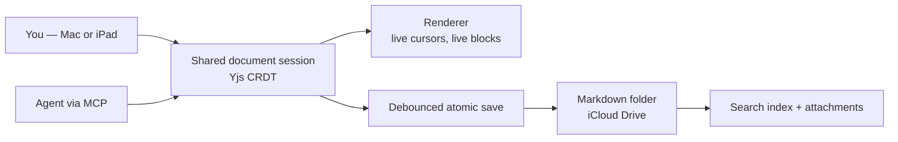
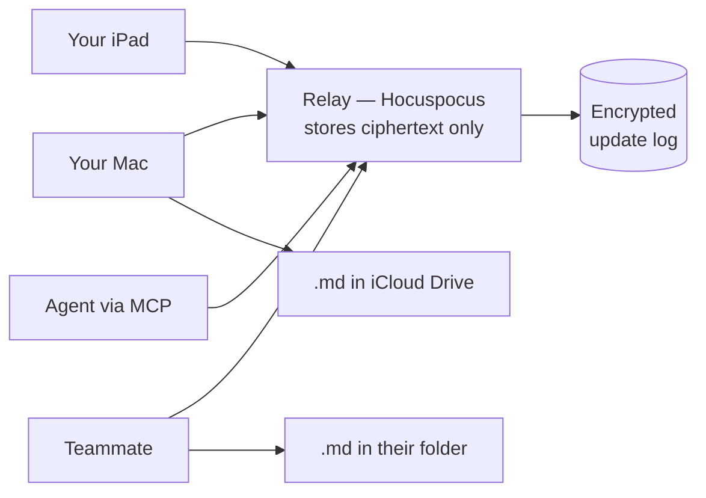

# SimpleMark — Live Collaboration

**A living document where humans and agents think together in real time, and the output is still yours as files.**

- **Status:** Draft 1 — supersedes parts of `DESIGN.md` D1/D2/D7
- **Date:** 2026-08-01
- **Companion to:** [`DESIGN.md`](DESIGN.md), [`AGENT-WORKSPACE.md`](AGENT-WORKSPACE.md), [`RENDERERS.md`](RENDERERS.md)

---

## 1. What the product actually is

Not "beautiful Markdown with Mermaid." That is a feature.

> **N humans and N agents are in the same room, editing the same document and each other's work, at the same time. Every cursor is visible, every change is attributed, and the result still lands as ordinary Markdown files you own.**

The mental model is Google Wave for durable Markdown work, with agents as first-class participants rather than a chat panel bolted onto a notes app.

```text
Document:
  "We should use Yjs for live coordination."

You:
  highlight the sentence → "Why not Automerge?"

Agent (Architecture):
  starts a reply, researches, begins inserting a comparison table

You:
  interrupt → "Stop. Optimise for local-first and iPad."

Agent (Architecture):
  receives the interrupt mid-work, abandons the draft,
  revises the table and states the new tradeoff
```

Every participant — human or agent — has identity, cursor, selection, presence, a live inbox for redirects and stops, a visible scope, and transactions that can be reviewed and reverted. **There is no second class of participant.** A human may rewrite an agent's paragraph; an agent may improve a human's diagram; an agent may critique and edit another agent's table. The room does not care which kind of thing you are.

That symmetry is the point, and §5.7 is the machinery that keeps it from turning into a brawl.

### 1.1 The design rule that keeps it from becoming Slack

> **Chat is ephemeral coordination. The document is the durable result.**

Conversations exist to steer work and resolve decisions. Once resolved, the conclusion belongs in the document and the thread collapses. A note that accumulates a thousand un-resolved comment threads has failed.

---

## 2. What this changes

Three of the original decisions move. Stating it plainly rather than quietly amending them.

| Decision | Was | Now |
|---|---|---|
| **D1** Files are the truth | Files are the only truth | Files are the **durable** truth; a live session's CRDT is the **coordination** truth |
| **D2** Sync delegated to the cloud drive | iCloud propagates everything | iCloud is **per-vault durable storage**, written once by a save leader (§3.4); **real-time runs over an encrypted relay**, never over file propagation |
| **D7** Fidelity contract | Untouched blocks re-emit verbatim | **Unchanged** — see §6.3. Original source per block lives in the CRDT. |

### 2.1 D8 — The live session owns coordination; the file owns durability



**Ownership rule, stated once and obeyed everywhere:**

| Document state | Coordination truth | On external file change |
|---|---|---|
| **Live** (a session is attached) | The Yjs doc | Import as a **named external transaction**, visible in Activity, revertible |
| **Cold** (no session) | The file | Load on open; nothing to reconcile |

A live document is **never** blindly replaced by a file read. If the session has unsaved local edits and the file changed underneath, the user sees a choice — the same diff UI `DESIGN.md` §8 already specifies, now with a third option: *merge the external change as a transaction*.

### 2.2 What honestly gets weaker

Say it out loud rather than discovering it later:

- **Two truths exist.** They can drift — a crash between the last CRDT op and the debounced save loses seconds of work. Mitigated by persisting the Yjs update log to `.simplemark/sessions/<id>.yupdate` on every transaction, so a crash replays rather than loses.
- **The folder is no longer sufficient on its own** while a session is live. It is still sufficient the moment the session ends, which is the property that matters for lock-in.
- **iCloud is now the wrong path for real-time.** It was never going to work for that anyway; this makes the split explicit instead of implicit.
- **A relay exists.** It is zero-knowledge and self-hostable, but it is infrastructure the single-machine design would not have needed. Running one is now part of the project.

---

## 3. Scope: multi-human, multi-device, from v1

Real multiplayer is in scope. You, your teammates, your iPad, and N agents can be in one document at once.

| In v1 | Deferred |
|---|---|
| Multiple humans in one document, live | Public/anonymous sessions |
| Multiple devices per human (Mac, iPad) | Org accounts, SSO, billing |
| N agents as participants, editing each other | Federated agent identity |
| Presence, cursors, selections, attribution | Fine-grained per-block ACLs |
| Interruption and steering | Comment-only guest links |
| Per-participant undo, transaction revert | Server-side conflict analytics |
| Region leases, loop breaker, scoped agent roles | Agent-to-agent negotiation protocols |

This costs four subsystems the single-machine version avoided. Each is specified below, and none of them requires an account system.

### 3.1 Transport: a dumb, zero-knowledge relay

Peers cannot reliably reach each other across NATs, and a Mac-as-host dies when the lid closes. So there is a relay — deliberately the least trusted component in the system.



**The relay never sees your content.** Yjs updates are encrypted client-side with a per-document key before transmission; the relay stores and fans out opaque blobs. It knows document ids, participant public keys, and timing — nothing else. That keeps "local-first, your data" honest even with a server in the path.

- **Protocol:** Hocuspocus (the reference Yjs WebSocket server) over TLS, with an encryption extension on the client side.
- **Self-hostable in one command.** A single container, ~50 MB of RAM per active room. Anyone can run their own; the project ships one for convenience, never as a requirement.
- **LAN fast path:** peers on the same network discover each other via mDNS and sync directly, using the relay only for presence. Two people at one table do not round-trip through the internet.
- **Offline:** every client persists its own update log. Reconnect replays. Yjs merges. No conflict dialog, ever, for the collaborative path.

### 3.2 Identity: keys, not accounts

No sign-up, no password, no email. Each participant generates a keypair on first run.

| Concept | Mechanism |
|---|---|
| **Who you are** | An Ed25519 keypair in the OS keychain, plus a display name and colour |
| **Your other devices** | Paired by QR code or a 6-word phrase; a device joins your identity, it does not become a new person |
| **Inviting a human** | A share link carrying the document key and a capability. Anyone with the link can join — treat it like a Google Docs link |
| **Inviting an agent** | The MCP server is handed a scoped capability by you; agents never self-enrol |
| **Revocation** | Rotate the document key and re-issue links. Revoked peers can no longer decrypt new updates |

This gets real multi-human collaboration without building an account system, and it means the project can never leak a user database it doesn't have.

### 3.3 Permissions: capabilities the relay can check

Because content is encrypted, the relay cannot enforce rules about *what* you write — but it can enforce *whether* you may write at all, because every update is signed.

| Capability | Can |
|---|---|
| `owner` | Everything, plus rotate keys and revoke peers |
| `editor` | Read, write, comment, run agents |
| `commenter` | Read, add Conversation-layer threads; document writes rejected |
| `reader` | Read only; presence visible |

The relay verifies the signature and the capability grant on every update and rejects unauthorized writes at the door. Clients enforce the same rules locally, so a malicious client cannot corrupt a document even if it bypasses the relay.

**Agents get their own capability, always narrower than the human who invited them,** and it is visible in the participant list. An agent invited by a `commenter` cannot write to the document.

### 3.4 The save-leader problem — the trap

**This is the failure mode that would otherwise appear in month three.**

Every client holds the same document, and every client wants to write `note.md` into its own synced folder. On one machine that is fine. With three humans and two devices, five clients writing the same logical note into five folders — and iCloud propagating between two of yours — produces a steady stream of `(conflicted copy)` files, all containing *identical* content. The collaboration works perfectly and the filesystem looks broken.

**Rule: exactly one client per storage location is the save leader.**

- Each *vault* (a folder on a device) elects a leader among the clients attached to it — normally the only one.
- The leader alone performs the debounced Markdown write. Others render, edit, and sync through the CRDT but never touch that folder.
- Leadership is a lease in the CRDT's awareness channel: it expires in 10 seconds and is reclaimed if the leader disappears, so closing a laptop hands off automatically.
- Your teammate's Mac is a *different* vault and has its own leader. Everyone ends up with their own portable copy, written once each.

Without this rule, multi-device and files-on-disk actively fight. With it, they compose.

---

## 4. The three layers of a document

| Layer | Contains | Persisted as |
|---|---|---|
| **Canvas** | The polished Markdown document and rendered blocks | The `.md` file |
| **Conversation** | Threads anchored to a range, block, or diagram node — including work requests and interruptions | `.simplemark/threads/<noteId>.json` |
| **Activity** | Who changed what, agent status, reversible transactions, snapshots | `.simplemark/activity/<noteId>.jsonl` |

Only the Canvas is portable Markdown. Conversation and Activity are sidecars — losing them loses history and discussion, never content. That asymmetry is deliberate: **the thing you own must survive the thing you don't need.**

### 4.1 Anchors

Comments, agent work requests, and pending edits all attach to **CRDT-relative positions** (Yjs `RelativePosition`), not line numbers or byte offsets. If you type three paragraphs above an agent's intended insertion point while it is thinking, it still inserts in the right place, and your comment still points at the right sentence.

This replaces the content-hash anchors in [`AGENT-WORKSPACE.md`](AGENT-WORKSPACE.md) §3.1 **while a session is live**. Those remain correct for cold-file patching — both mechanisms exist, and the MCP tool surface picks by document state.

---

## 5. Agents as participants

### 5.1 Identity and presence

An agent gets what a person gets: a name, a colour, a cursor, a selection, and a status. `Codex is drafting a diagram…` appears in the presence bar exactly as a human's typing indicator would.

### 5.2 Two modes

| Mode | Behavior | Default |
|---|---|---|
| **Collaborate** | Edits the live document directly, with its own cursor and attributed transactions | Yes, for personal use |
| **Suggest** | Streams proposed edits as tracked suggestions you accept or reject | For unattended or unfamiliar agents |

A single **Pause agent edits** button freezes all agent writes without disconnecting them. Non-negotiable — sometimes you need to write without something else moving the page.

### 5.3 Transactions, not keystrokes

An agent edit is grouped and named: *"Added architecture section"* — not 70 individual operations. This matters in three places at once: the Activity timeline is readable, revert works at a meaningful granularity, and your `Cmd+Z` is not endangered.

Agents stream by **coherent unit** — a heading, then a paragraph, then a diagram — never character by character. Character-level AI typing is a novelty for ten seconds and an irritation forever.

### 5.4 Interruption is out-of-band

**The correction that makes steering actually work:** an interrupt must not travel through document operations. A busy agent writing a table will not notice a new comment until it finishes the table — which is exactly the moment you were trying to prevent.

So there is a separate control channel:

```ts
interface AgentControl {
  status: 'idle' | 'thinking' | 'writing' | 'paused'
  inbox: ControlMessage[]        // polled between every step
}

type ControlMessage =
  | { t: 'stop';     reason?: string }
  | { t: 'redirect'; instruction: string; anchor?: RelativePosition }
  | { t: 'pause' } | { t: 'resume' }
  | { t: 'scope';    ranges: RelativePosition[] }   // "only work in this section"
```

**Contract:** an agent must drain its inbox between every step of a multi-step edit, and must abandon in-flight work on `stop`. An agent that ignores its inbox is disconnected by the host after one warning. This is enforced, not requested.

### 5.7 Many agents in one room

Symmetry creates one failure mode that a single-agent design never has: **agent thrash.** Agent A rewrites a paragraph, Agent B disagrees and rewrites it back, A responds. Nobody typed anything and the document has churned forty times.

Four mechanisms, all cheap, all enforced by the host rather than requested of the model.

#### Region leases (soft locks)

A participant intending sustained work on a region takes a lease on it:

```ts
interface RegionLease {
  range: [RelativePosition, RelativePosition]
  holder: ParticipantId
  intent: string          // "rewriting the storage section"
  expiresAt: number       // 60s, renewed while active
}
```

- **Agents must take a lease before a multi-step edit.** Refused if one is held; the agent waits, works elsewhere, or asks.
- **Humans never wait.** A human typing into a leased region breaks the lease immediately and the holder is told. Human intent always wins — this is a soft lock for coordinating machines, not a gate on people.
- Leases are visible: a soft margin tint and `Codex is rewriting this section`.

#### Loop breaker

Every block carries a short revision chain of who last touched it. If a block is modified by agents **three times in a row with no human edit between**, further agent writes to it are refused and the block is flagged in Activity:

> *"Codex and Critic have revised this paragraph 3× without human input — review needed."*

The counter resets on any human edit. This converts an infinite loop into a question, which is the correct outcome.

#### Reaction budget

An agent responding to *another agent's* edit spends from a budget: **5 reactions per document per hour**, refilled by human activity. Agents responding to *human* edits are unlimited. This makes human-directed work cheap and machine-to-machine argument expensive, which is the incentive you want.

#### Scoped roles

Agents are invited into a room with a declared scope, visible in the participant list:

| Scope | Example |
|---|---|
| `section: "Architecture"` | may only write inside that heading |
| `layer: conversation` | may only comment, never edit the canvas |
| `kind: mermaid, vega-lite` | may only author or amend those blocks |
| `readonly` | reviewer — comments and suggestions only |

A critic agent gets `layer: conversation`. A diagram agent gets `kind: mermaid`. They cannot collide because their capabilities do not overlap — the cheapest deconfliction available, and it costs nothing at runtime.

#### Attribution with mixed authorship

A block edited by three participants shows all three in its margin chip, most recent first, and the Activity timeline holds the full chain. Provenance is never collapsed to "last writer" — in a room where an agent may polish a human's prose, "who wrote this" is genuinely a list.

### 5.5 Delegation in the document

The interaction that ties it together:

```text
[select a paragraph, a diagram, or a range]
  → Ask agent
      → Improve this
      → Find evidence
      → Turn this into a chart
      → Challenge this assumption
      → Implement this elsewhere
```

The agent receives exactly that scope as context, writes its work into that location, and stays interruptible. **The causal chain from prompt → reasoning → source → artifact is never lost**, because the request is a Conversation-layer thread anchored to the same position the resulting edit lands in.

---

## 6. Mechanics

### 6.1 Undo

`Cmd+Z` undoes **your** last action. Never an agent's, never another participant's.

Yjs's `UndoManager` supports exactly this via tracked origins: each participant's operations carry an origin tag, and each client's undo stack filters to its own. Agent transactions are reverted deliberately from the Activity timeline, not accidentally by a keystroke.

### 6.2 Save

```text
edit → Yjs → live canvas → debounce 800 ms and on blur → serialize → atomicWrite
```

Every transaction also appends to `.simplemark/sessions/<id>.yupdate` immediately, so a crash costs nothing. The debounce governs the *Markdown* write, not durability.

### 6.3 Fidelity survives — D7 stands

The claim that byte-identical preservation must soften is **not** the tradeoff being made here. Each block in the Yjs document carries:

```ts
interface BlockState {
  content: Y.XmlFragment      // the live, editable representation
  originalSource: string      // exact bytes as loaded from disk
  dirty: boolean              // set by the first op that touches this block
}
```

On save, clean blocks emit `originalSource` verbatim; dirty blocks serialize. Identical to the design in `DESIGN.md` D7 — the source spans simply live in the CRDT instead of a plain array. The ten acceptance fixtures apply unchanged, and the Phase 0 spike is still the gate.

What actually softens is the *ownership* claim, not the *fidelity* claim: while a document is live, the file is a projection rather than the master. §2.1 states it precisely.

### 6.4 UX requirements — these are the product, not polish

- Your cursor neutral; each agent named and distinctly coloured.
- Live selection shown for every participant.
- Compact status line: `Codex is drafting a diagram…`
- Local changes animate; remote changes appear by coherent unit.
- **Never steal the viewport.** "Follow agent" is opt-in and scrolls to its selection; an agent working elsewhere does not move your page.
- Attribution visible in the document margin and in the timeline.
- Timeline lets you inspect, jump to, or revert any transaction.

---

## 7. MCP, revised for live documents

[`AGENT-WORKSPACE.md`](AGENT-WORKSPACE.md)'s tool surface was designed for cold files. It stays — an agent should be able to work in notes nobody has open — and gains a live surface alongside it.

| Cold file (existing) | Live session (new) |
|---|---|
| `read_note` → `{content, rev}` | `open_live_note(path)` → `{docId, content, participants}` |
| `patch_note(id, expected_rev, edits)` | `apply_transaction(docId, name, ops[])` |
| anchors by content hash | anchors as `RelativePosition` |
| — | `subscribe(docId)` → change + presence stream |
| — | `set_presence(docId, cursor, selection, status)` |
| — | `insert_at_anchor(docId, anchor, markdown)` |
| — | `apply_structured_block(docId, anchor, kind, source)` |
| — | `poll_control(docId)` → `ControlMessage[]` |

**Routing rule:** if a session exists for the note, live tools apply and cold writes are refused with `{ error: 'note_is_live', docId }`. If not, cold tools apply. One rule, no ambiguity, no split brain.

`apply_structured_block` is how an agent adds a Mermaid diagram or a Vega-Lite chart — it names a kind from the renderer catalog and supplies source, so the block arrives already correct rather than as text that happens to sniff correctly.

---

## 8. Revised build sequence

The gate moved. It is no longer "the file watcher caught an agent write."

| Phase | Deliverable | Proof |
|---|---|---|
| **0** | **Collaboration spike** | Two app windows, two simulated humans and two simulated agents in one room: concurrent inserts merge, cursors show, per-client undo is correct, a client disconnects and reconnects cleanly, and two agents editing the same paragraph trip the loop breaker instead of thrashing |
| **0b** | **Fidelity spike** (`DESIGN.md` §12) | The 10 fixtures survive, now with block state in the CRDT |
| **1** | **Markdown bridge** | Load and save real notes, render Mermaid and SVG, without destroying source |
| **2** | **MCP participant** | Live read, subscribe, transactional edit, control channel |
| **3** | **Rich blocks** | Mermaid, SVG, code, math, then charts |
| **4** | **Conversation + Activity layers** | Anchored threads, delegation menu, transaction timeline and revert |
| **5** | **Bear-parity shell** | Three panes, tags, search, typography |
| **6+** | **Second device** | iPad joins the session; offline and reconnect behavior |
| **7+** | Excalidraw, converters, public plugin API | |

**Phase 0 now runs before the fidelity spike**, because if live collaboration doesn't work the fidelity question is moot. Both are days, not weeks.

### 8.1 The definition of done for v1

> You and a colleague are typing in one document. Codex adds a diagram next to the paragraph it is explaining; a Critic agent comments on your colleague's claim and proposes an edit to Codex's table. Every cursor is visible and named. You interrupt Codex mid-table and it changes course. `Cmd+Z` undoes your sentence and nobody else's. The two agents do not thrash, because the second round trips the loop breaker. Your colleague's Mac and your iPad both hold clean, portable Markdown that opens correctly in Bear.

---

## 9. Open questions

1. **Does the app own the collaboration service, or is it a sidecar process?** In-process is simpler and dies with the app; a sidecar survives app restarts and is the path to the iPad. Probably in-process for v1, extracted at Phase 6.
2. **Block-level CRDT granularity.** A whole-document `Y.XmlFragment` is what ProseMirror bindings expect, but §6.3 needs per-block original source. Likely a `Y.Map` of block states beside the fragment, kept in sync by the same transaction. **This is the first thing the Phase 0 spike should test.**
3. **Suggest mode representation.** Tracked suggestions as a separate CRDT layer, or as marks in the main document? Marks are simpler and survive save as nothing; a separate layer is cleaner but doubles the merge surface.
4. **What happens to a live session when iCloud delivers a `(conflicted copy)`.** The import-as-transaction rule covers external edits to the same file, but a conflicted copy is a new file. Probably surfaces as a diff against the live doc.
