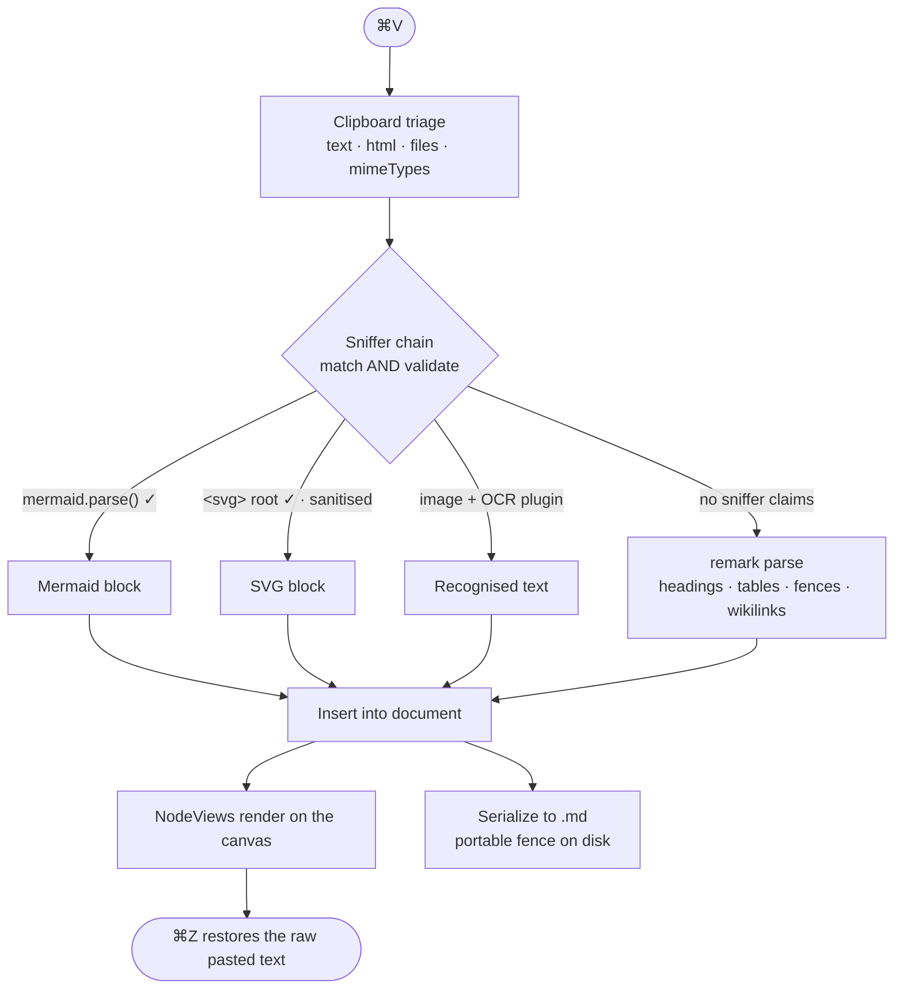

# SimpleMark — Design Document

- **Status:** Draft for review
- **Date:** 2026-08-01
- **Working title:** SimpleMark
- **One line:** An open-source Bear clone with world-class typography that renders raw Markdown, Mermaid, SVG, and code the instant you paste it.

---

## 1. What this is

Bear got the feel right — calm three-pane layout, beautiful typography, tags instead of folders, plain-text notes, invisible sync. It got the rendering wrong: paste a Mermaid diagram and you get grey text.

Obsidian and friends render more, but make you configure a vault, install plugins, and buy sync.

SimpleMark is Bear's feel with a renderer that never says no.

**The defining behavior:** you paste raw Mermaid source or a raw `<svg>` tag with no code fence, and it becomes a picture. No mode switch, no menu, no plugin install.

---

## 2. Architectural decisions

These were settled during brainstorming and are the load-bearing choices.

### D1 — Files are the truth

Notes are plain `.md` files in a folder the user picks. SQLite is a rebuildable cache (search index, link graph, thumbnails) and never authoritative.

**Consequence:** zero lock-in is literally true, not a promise. Every feature must round-trip to Markdown or it does not ship.

### D2 — Sync is delegated to the cloud drive

No CRDT, no relay server, no accounts, no hosting bill. The notes folder lives in iCloud Drive (or Dropbox, or any synced folder) and the OS handles propagation.

**Accepted costs:**
- Simultaneous offline edits on two devices produce a `(conflicted copy)` file. Mitigated by save-on-blur with short debounce, plus a conflict-detection UI offering a side-by-side diff.
- No real-time collaboration. Not wanted.
- iOS is the weak spot: iCloud Drive works via the file provider; Dropbox and Google Drive on iOS are apps rather than filesystems and background folder sync is unreliable. **iCloud Drive is the supported iOS path.**

### D3 — Milkdown as the editor core

Milkdown (MIT) sits on ProseMirror + remark. Its premise is Markdown-AST-as-truth with the editor as a view over it — which is D1 expressed as a library. Tiptap was the alternative; it would require writing and maintaining a Markdown serializer forever.

Both are ProseMirror underneath, so the schema and NodeViews port if this proves wrong.

### D4 — A single unified canvas

No source pane, no preview pane, no mode toggle. Editing and rendering happen in the same view. Click a rendered diagram to reveal its source inline.

### D5 — Everything is a plugin, including the built-ins

Mermaid, SVG, code highlighting, tables, and wikilinks are written against the same public plugin API that third parties use. If a built-in needs a private hook, the API is wrong.

This is what makes handwriting + OCR possible later without a rewrite.

### D6 — Typography is a document-level setting

Per-selection font/size/colour cannot be expressed in Markdown, so it does not exist. Bear works the same way: font family, size, line height, line width, and theme are preferences. The toolbar handles structure and emphasis only.

---

## 3. System architecture

```
┌─ Shells ─────────────────────────────────────────────┐
│  Tauri (macOS first, then Win/Linux)                 │
│  Capacitor (iOS/iPad — deferred)                     │
│  provides: filesystem, file watcher, pen events,     │
│            share sheet, native menus                 │
└──────────────────┬───────────────────────────────────┘
                   │  NativeBridge (one narrow interface)
┌──────────────────▼───────────────────────────────────┐
│  simplemark-core  (TypeScript, no DOM)               │
│   ├─ Vault        folder scan, file watch, read/write│
│   ├─ NoteIndex    SQLite FTS5 cache (rebuildable)    │
│   ├─ LinkGraph    [[wikilink]] resolution + backlinks│
│   ├─ Attachments  content-addressed sidecar files    │
│   └─ PluginHost   registry + capability gating       │
└──────────────────┬───────────────────────────────────┘
┌──────────────────▼───────────────────────────────────┐
│  simplemark-editor  (Milkdown / ProseMirror)         │
│   paste pipeline · node registry · NodeView host     │
│   bubble toolbar · slash menu · input rules          │
└──────────────────┬───────────────────────────────────┘
┌──────────────────▼───────────────────────────────────┐
│  simplemark-ui  (three-pane shell, theming)          │
└──────────────────────────────────────────────────────┘
```

Each package has one job, a typed interface, and can be tested without the others. `simplemark-core` has no DOM dependency so it runs under Node in tests.

---

## 4. The paste pipeline

This is the product. Everything else supports it.

```
Cmd+V
 │
 ├─ 1. Clipboard triage
 │      collect {text, html, files, mimeTypes}
 │
 ├─ 2. Sniffer chain          ← plugins register here
 │      mermaid · svg · image · (third-party)
 │      first sniffer to both MATCH and VALIDATE wins
 │      → returns a typed AST node
 │
 ├─ 3. No sniffer hit → remark parses as Markdown
 │      headings · tables · fences · lists · wikilinks
 │
 └─ 4. Insert into the document → NodeViews render
        one Cmd+Z restores the raw pasted text
```

### Sniffer contract

```ts
interface PasteSniffer {
  id: string
  priority: number
  sniff(input: ClipboardInput): AstNode | null   // must validate, must not throw
}
```

**Validation is mandatory.** A sniffer may only claim content it has proven it can render:

- **Mermaid** — first non-blank line matches
  `/^\s*(flowchart|graph|sequenceDiagram|classDiagram|stateDiagram(-v2)?|erDiagram|journey|gantt|pie|gitGraph|mindmap|timeline|quadrantChart)\b/`
  **and** `mermaid.parse()` succeeds.
- **SVG** — parses as XML with an `<svg>` root element, and passes sanitisation (§7).

Text that looks like Mermaid but does not parse stays text. A sniffer that throws is skipped; a bad plugin can never break paste.

### Three rules that make it feel like magic rather than a trick

1. **Never guess silently wrong** — conversion requires successful parse.
2. **Never lose the source** — the block stores the original text and writes a normal fenced code block to disk. The `.md` file stays portable to GitHub and back.
3. **Fail visibly** — broken diagram source renders an inline error card with the parser message, never a blank rectangle.

Each converted block shows a small "keep as plain text" affordance for a few seconds after insertion.

---

## 5. Plugin API

A plugin declares any of five contributions. Nothing is special-cased.

| Contribution | Purpose | Mermaid | SVG | Code | Handwriting (later) |
|---|---|---|---|---|---|
| `node` | schema + markdown parse/serialize | ✓ | ✓ | ✓ | ✓ |
| `nodeView` | owns a rectangle: DOM, canvas, events | ✓ | ✓ | ✓ | ✓ |
| `sniffer` | claim a paste | ✓ | ✓ | — | ✓ (image → OCR) |
| `command` | slash menu / shortcut entry | ✓ | ✓ | ✓ | ✓ |
| `capability` | fs, network, pen input, compute | — | — | — | ✓ |

```ts
interface Plugin {
  id: string
  nodes?: NodeSpec[]
  nodeViews?: Record<string, NodeViewFactory>
  sniffers?: PasteSniffer[]
  commands?: Command[]
  capabilities?: Capability[]
}
```

### The serialization rule

**Every node must round-trip to Markdown.** A block with no textual representation writes a sidecar file under `attachments/` and embeds a reference:

```
![[ink:9f3a2b.strokes.json]]
```

This is what keeps "just files" honest even for binary plugins, and it means plugin data syncs through the cloud drive for free — no plugin needs to know sync exists.

### Reference implementations shipped in v1

| Plugin | ~Size | Notes |
|---|---|---|
| `mermaid` | 60 lines + NodeView | debounced render, click-to-edit source, error card |
| `svg` | 50 lines | sanitised, click-to-edit markup |
| `code` | 40 lines | Shiki highlighting, copy button, language label |
| `wikilink` | 80 lines | `[[Note]]` resolution, autocomplete, create-on-click |
| `table` | from GFM preset | interactive grid editing |

Writing four built-ins against the public API is the proof the API is real.

---

## 6. Editor surface (Bear parity)

**Formatting bubble** on selection, plus keyboard shortcuts and live input rules (`**bold**` renders as you type):

bold · italic · strikethrough · highlight · inline code · H1–H3 · bullet list · numbered list · checkbox · quote · link · code block · divider

Built from `@milkdown/preset-commonmark` + `@milkdown/preset-gfm`, `@milkdown/kit/plugin/tooltip` (Floating UI positioned), `@milkdown/kit/plugin/slash`, `prosemirror-keymap`, `prosemirror-inputrules`. Icons from Lucide (MIT).

**Typography preferences** (D6): font family, size, line height, line width, theme (light/dark/auto). Ships with a curated set of genuinely good text faces rather than a system font dump.

**Layout:** three panes — tags sidebar, note list, editor. Collapsible to two or one. Bear's proportions and calm.

---

## 7. Security

SVG and Markdown-embedded HTML are untrusted input. A pasted `<svg>` can carry `<script>`, `onload=`, and external references.

- All SVG passes **DOMPurify** with SVG profile before rendering; scripts, event handlers, and external references are stripped.
- Rendered content runs with a strict CSP; no remote fetches from note content.
- Mermaid runs with `securityLevel: 'strict'` (HTML labels disabled).
- Plugins declare capabilities; filesystem and network access are gated and disclosed at install.

---

## 8. Error handling

| Failure | Behavior |
|---|---|
| Diagram source does not parse | Inline error card with parser message; source stays editable |
| Sniffer throws | Skipped, logged; paste falls through to Markdown |
| Plugin NodeView throws | Block renders as a fenced code block; plugin marked unhealthy |
| File changed on disk while open | Reload if the editor is clean; conflict diff UI if dirty |
| Cloud drive produces a conflicted copy | Detected on scan; surfaced as a diff with keep-mine / keep-theirs / merge |
| Index corrupt or missing | Silently rebuilt from the folder |

The governing rule: **failures are visible and local.** No silent fallbacks, no blank rectangles, no crash on bad input.

---

## 9. Testing

- **Round-trip property tests** — for a corpus of real documents, `parse → serialize` must be byte-identical. This is the single most important test in the project; it is what makes files-as-truth safe. Corpus seeded with the Switchboard borrowing-map document that motivated this project.
- **Sniffer tests** — table-driven: fenced Mermaid, bare Mermaid, near-miss text that must *not* convert, malformed SVG, XSS payloads.
- **Vault tests** — scan, watch, external edit, conflicted copy, rename, delete. `simplemark-core` is DOM-free so these run fast under Node.
- **Plugin API conformance** — the four built-ins run against the public API only; a lint rule forbids private imports.
- **Visual regression** on the editor chrome and the three renderers.

---

## 10. Wireframe

Interactive version: [`docs/wireframe.html`](wireframe.html) — open it in a browser. It renders live Mermaid inside the mock editor pane, follows the system light/dark theme, and shows the paste sequence and failure states.

### 10.1 Main window

Three panes, Bear's proportions. Collapsible to two or one.

```
┌──────────────────────────────────────────────────────────────────────────┐
│ ● ● ●   SimpleMark                            ● iCloud Drive / Notes     │
├───────────────┬──────────────────┬───────────────────────────────────────┤
│ LIBRARY       │ ⌕ Search notes   │  Switchboard ↔ Agent Orchestrator     │
│  All Notes 412│                  │  #architecture/reviews · 2,883 words  │
│  Untagged   9 │ ▸ Switchboard ↔  │                                       │
│  Archive   88 │   Agent Orch.    │  ┌─[ B I S H </> │ H1 H2 │ • ☑ 🔗 ]─┐ │
│               │   Today · 14:22  │  Reviewed [[ADR-0008]] against their  │
│ TAGS          │                  │  daemon. Their reducer is our own     │
│ ▸#architecture│   ADR-0027 —     │  hydrate → reduce → act pattern…      │
│    /adr    12 │   Open source    │                                       │
│    /reviews  7│   Today · 09:41  │  ┌─────────────────────────────────┐  │
│  #switchboard │                  │  │ Track │ What        │ Verdict   │  │
│  #taikun      │   Warm pool      │  ├───────┼─────────────┼───────────┤  │
│  #reading     │   invalidation   │  │ A     │ tmux runtime│ Adopt     │  │
│               │   Yesterday      │  └─────────────────────────────────┘  │
│               │                  │                                       │
│               │   Paste parser   │  ┌ mermaid · rendered ── Edit source ┐ │
│               │   scratch        │  │      ╭──────────╮                │ │
│               │   Jul 30         │  │      │ START    │──▶ start_task   │ │
│               │                  │  │      ╰──────────╯                │ │
│               │                  │  └───────────────────────────────────┘ │
│               │                  │                                       │
│               │                  │  ┌ svg · sanitised ──── Edit markup ┐ │
│               │                  │  │  [capacity] [comms] [coord]      │ │
│               │                  │  └───────────────────────────────────┘ │
│               │                  │                                       │
│               │                  │  ┌ javascript · Shiki ─────── Copy ─┐ │
│               │                  │  │ export const mermaidSniffer = {  │ │
│               │                  │  └───────────────────────────────────┘ │
└───────────────┴──────────────────┴───────────────────────────────────────┘
```

### 10.2 Rendered block anatomy

Every plugin-rendered block shares one frame, so a third-party block is indistinguishable from a built-in:

```
┌─────────────────────────────────────────────────────┐
│ ⟨type⟩ · ⟨provenance⟩              [Edit source] [⧉] │  ← block bar, appears on hover
├─────────────────────────────────────────────────────┤
│                                                     │
│              rendered output (NodeView)             │  ← plugin owns this rectangle
│                                                     │
└─────────────────────────────────────────────────────┘
```

**Open question for build time:** the frame above is legible but heavier than Bear would use. The alternative is bare blocks in the prose with controls fading in on hover. Decide during the first UI pass with real content on screen.

### 10.3 Paste sequence



A sniffer that throws is skipped, never crashes the paste. Content that matches but fails validation stays plain text.

### 10.4 Failure and preference states

| State | Treatment |
|---|---|
| Diagram source does not parse | Inline error card, red-tinted, showing the parser's own message (`Parse error on line 4: expected node id, got '-->'`). Source stays editable in place. Never a blank rectangle. |
| Near-miss text | Prose that resembles Mermaid but fails `parse()` renders as ordinary paragraph text. No conversion, no prompt. |
| Just converted | A transient "keep as plain text" affordance in the block corner for a few seconds. |
| Typography preferences | Editor font · size · line height · line width · theme. Document-level only, per §D6. |

### 10.5 Visual identity

Teal accent (`#0d6f80` light, `#4fc3d4` dark) rather than Bear's red — the clone should not impersonate the original, and teal reads as an engineering tool rather than a writing app. Neutrals carry a slight cool bias toward the accent. Serif body face (Iowan Old Style / Palatino / Georgia) for note content, system sans for chrome, monospace for code and provenance labels. One accent token; trivially re-themed.

---

## 11. v1 scope

**In:**
- Milkdown canvas, files-as-truth, iCloud Drive folder, macOS via Tauri
- Paste magic: raw Mermaid, raw SVG, raw Markdown, tables, wikilinks
- Shiki syntax highlighting for pasted code
- Bear-style formatting bubble, slash menu, shortcuts, typography preferences
- Three-pane layout, tags, SQLite FTS search
- Plugin API, with the built-ins as its proof

**Deferred (API designed for them now, not built):**
- iOS/iPad shell · handwriting + OCR plugin · graph view · plugin manifests and store · Windows/Linux · encryption · themes gallery

---

## 12. Open questions

None blocking. Two to revisit after the first spike:

1. Whether Milkdown's serializer is faithful enough for the round-trip property test, or whether the remark-stringify layer needs replacing. **This is the first thing to spike** — it validates or kills D3 in a day.
2. Whether Dropbox and Google Drive can be supported on iOS at all, or whether iCloud Drive is the only viable mobile path.

---

## 13. Licensing

**Apache-2.0** or **MIT** — permissive, so the plugin ecosystem and any future hosted service stay possible. Explicitly not GPL/AGPL, which is what makes Zettlr and Logseq unforkable for this purpose.

Milkdown (MIT), ProseMirror (MIT), remark (MIT), Shiki (MIT), Lucide (MIT), DOMPurify (Apache-2.0/MPL), Tauri (MIT/Apache-2.0) are all compatible.
