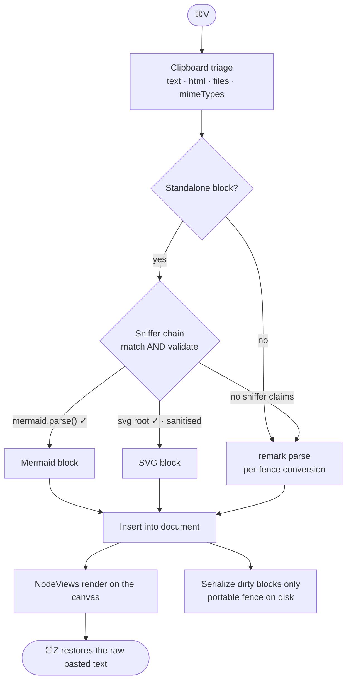

# SimpleMark — Design Document

- **Status:** Draft, revision 3 — **D1/D2 superseded in part by [`COLLABORATION.md`](COLLABORATION.md)**
- **Date:** 2026-08-01
- **Working title:** SimpleMark
- **One line:** A living, local-first workspace where you and AI agents think together in one document — and the output stays yours as portable Markdown.

---

> **Read [`COLLABORATION.md`](COLLABORATION.md) first.** The product grew: a live CRDT session now owns
> coordination while a document is open, and files own durability. That changes D1 and D2 below.
> D7 (fidelity) is unchanged — block source spans simply live in the CRDT.

---

## 1. What this is

Bear got the feel right — calm three-pane layout, beautiful typography, tags instead of folders, plain-text notes, invisible sync. It got the rendering wrong: paste a Mermaid diagram and you get grey text.

Obsidian and friends render more, but make you configure a vault, install plugins, and buy sync.

SimpleMark is Bear's feel with a renderer that never says no.

**The defining behavior:** you paste raw Mermaid source or a raw `<svg>` tag with no code fence, and it becomes a picture. No mode switch, no menu, no plugin install.

---

## 2. Architectural decisions

These are the load-bearing choices. D3 is the only one gated on a spike; see §12.

### D1 — Files are the truth

Notes are plain `.md` files in a folder the user picks. SQLite is a rebuildable cache (search index, link graph, thumbnails) and never authoritative.

**Consequence:** zero lock-in is literally true, not a promise. Every feature must round-trip to Markdown or it does not ship — subject to the fidelity contract in D7 and the portability tiers in §5.

**Amended by D8** ([`COLLABORATION.md`](COLLABORATION.md) §2.1): while a document has an active session, the Yjs CRDT is the *coordination* truth and the file is a projection of it. The moment the session ends, the folder is sufficient on its own again — which is the property lock-in actually depends on.

### D2 — Sync is delegated to the cloud drive

No CRDT, no relay server, no accounts, no hosting bill. The notes folder lives in iCloud Drive (or Dropbox, or any synced folder) and the OS handles propagation.

**Accepted costs:**
- Simultaneous offline edits on two devices produce a `(conflicted copy)` file. Handled per §8.
- No real-time collaboration. Not wanted.
- iOS is the weak spot: iCloud Drive works via the file provider; Dropbox and Google Drive on iOS are apps rather than filesystems and background folder sync is unreliable. **iCloud Drive is the supported iOS path.**

**Amended by D8:** the cloud drive is durable sync and offline fallback only. Real-time collaboration runs over a localhost WebSocket, never over file propagation — a file watcher has no presence, no cursors, no interruption channel, and cannot merge two edits to one paragraph.

### D3 — Milkdown as the editor core *(gated on the §12 spike)*

Milkdown (MIT) sits on ProseMirror + remark. Its premise is Markdown-AST-as-truth with the editor as a view over it — which is D1 expressed as a library.

**This decision is not final.** D7 imposes a fidelity requirement that no off-the-shelf Markdown editor satisfies out of the box. The spike in §12 determines whether Milkdown can be extended to meet it or whether the document model has to be built on raw ProseMirror + a source-mapping layer.

Tiptap was the alternative and fails the same test for the same reason; the choice is really "Milkdown vs. hand-rolled source-preserving model," and both are ProseMirror underneath, so schema and NodeViews port either way.

### D4 — A single unified canvas

No source pane, no preview pane, no mode toggle. Editing and rendering happen in the same view. Click a rendered diagram to reveal its source inline.

### D5 — Internal extension points in v1; public plugin API deferred

Mermaid, SVG, code highlighting, tables, and wikilinks are written against one internal extension interface, and that interface is designed to become the public API. If a built-in needs a hook the interface doesn't expose, the interface is wrong.

**What is deliberately not in v1:** third-party plugin loading. A real public plugin runtime needs execution isolation, a versioned and migratable schema contract, defined behavior when a note references an unavailable plugin, and enforcement of declared capabilities at the native boundary — not merely their declaration. That is a subsystem, and shipping it before the document model is proven risks freezing the wrong API forever.

Opening the API later is then a decision, not a rewrite. Handwriting + OCR is the first intended external plugin and lands after the API opens.

### D6 — Typography is a document-level setting

Per-selection font, size, and colour cannot be expressed in Markdown, so they do not exist. Bear works the same way: font family, size, line height, line width, and theme are preferences. The toolbar handles structure and emphasis only.

### D7 — Fidelity contract: source preservation, not re-serialization

**Untouched content is never rewritten.** Opening a note and saving it must produce a byte-identical file. Editing one paragraph must not renumber lists, restyle fences, repad tables, or normalize bullets elsewhere in the document.

Byte-identical round-trip through a general Markdown serializer is not achievable — remark normalizes bullet markers, table padding, fence style, setext headings, entity escaping, and blank-line runs. So fidelity is defined in two tiers:

| Tier | Scope | Guarantee |
|---|---|---|
| **Preserved** | Blocks the user did not edit this session | Original source text is retained and re-emitted verbatim |
| **Normalized** | Blocks the user edited | Serialized by remark; semantic equivalence only, house style applied |

**Implementation:** every top-level block node carries the byte range of its original source. Clean blocks re-emit that slice. Dirty blocks serialize. Front matter, arbitrary embedded HTML, and unknown constructs are always preserved as opaque source, never round-tripped through the AST.

This is the hardest requirement in the project and the reason §12 exists.

**Unchanged by D8.** Under live collaboration, `originalSource` and `dirty` live in the CRDT beside each block's content ([`COLLABORATION.md`](COLLABORATION.md) §6.3). Clean blocks still emit their original bytes. The ten acceptance fixtures apply unchanged.

---

## 3. System architecture

```
┌─ Shells ─────────────────────────────────────────────┐
│  Tauri (macOS first, then Win/Linux)                 │
│  Capacitor (iOS/iPad — deferred)                     │
│  provides: filesystem, file watcher, pen events,     │
│            share sheet, native menus                 │
└──────────────────┬───────────────────────────────────┘
                   │  NativeBridge (one narrow interface)
┌──────────────────▼───────────────────────────────────┐
│  simplemark-core  (TypeScript, no DOM)               │
│   ├─ Vault        scan · watch · atomic write         │
│   ├─ SourceMap    block ↔ byte-range preservation (D7)│
│   ├─ NoteIndex    SQLite FTS5 cache (rebuildable)    │
│   ├─ LinkGraph    [[wikilink]] resolution + backlinks │
│   ├─ Attachments  content-addressed sidecar files     │
│   └─ Extensions   internal registry (D5)              │
└──────────────────┬───────────────────────────────────┘
┌──────────────────▼───────────────────────────────────┐
│  simplemark-editor  (Milkdown / ProseMirror)         │
│   paste pipeline · node registry · NodeView host      │
│   bubble toolbar · slash menu · input rules           │
└──────────────────┬───────────────────────────────────┘
┌──────────────────▼───────────────────────────────────┐
│  simplemark-ui  (three-pane shell, theming)          │
└──────────────────────────────────────────────────────┘
```

Each package has one job, a typed interface, and can be tested without the others. `simplemark-core` has no DOM dependency, so vault, source-mapping, and conflict tests run under Node.

---

## 4. The paste pipeline

This is the product. Everything else supports it.

```
Cmd+V
 │
 ├─ 1. Clipboard triage
 │      collect {text, html, files, mimeTypes}
 │
 ├─ 2. Sniffer chain          ← extensions register here
 │      svg-in-html · svg · mermaid · image · (built-ins only in v1)
 │      first sniffer to MATCH, VALIDATE and pass the
 │      standalone-block test wins
 │
 ├─ 3. No sniffer hit → remark parses as Markdown
 │      per-fence conversion for ```mermaid / ```svg blocks
 │
 └─ 4. Insert into the document → NodeViews render
        one Cmd+Z restores the raw pasted text
```

### 4.1 Sniffer contract

```ts
interface PasteSniffer {
  id: string
  priority: number
  sniff(input: ClipboardInput, ctx: PasteContext): AstNode | null
  // must validate; must not throw
}
```

### 4.2 Conversion rules — deterministic, in order

A sniffer may convert **only** when all four hold:

1. **Standalone block.** The caret is at a block boundary and the pasted text is the entire clipboard payload. Pasting into the middle of a sentence never converts — it inserts text.
2. **Signature match.** Mermaid: first non-blank line matches
   `/^\s*(flowchart|graph|sequenceDiagram|classDiagram|stateDiagram(-v2)?|erDiagram|journey|gantt|pie|gitGraph|mindmap|timeline|quadrantChart)\b/`.
   SVG: parses as XML with an `<svg>` root.
3. **Validation succeeds.** `mermaid.parse()` returns without throwing; SVG survives sanitisation (§7).
4. **No higher-priority sniffer claimed it.** Priority order is fixed: `svg-in-html (30) → svg (20) → mermaid (10) → image (5)`.

**Named ambiguous cases and their rulings:**

| Case | Ruling |
|---|---|
| Clipboard has `text/html` wrapping an `<svg>` | `svg-in-html` claims it. HTML path is not consulted. |
| Clipboard has both `text/html` and `text/plain`, no SVG | Markdown path on `text/plain` — pasted-from-browser HTML is not treated as a document. |
| Multi-block paste (prose + a ```mermaid fence + a table) | Markdown path. Fences convert per-block after parsing. Bare unfenced diagram source inside a larger paste stays text. |
| Prose beginning with the word "graph" | `mermaid.parse()` rejects it; stays text. |
| Valid Mermaid quoted inside a paragraph | Fails the standalone-block test; stays text. |
| User wants literal source | `⌘⇧V` pastes as plain text, always, with no sniffing. Permanent, not transient. |

### 4.3 Reversibility, in both directions

- `⌘Z` immediately after conversion restores the raw pasted text.
- A "keep as plain text" affordance appears in the block corner for a few seconds after insertion.
- **"Convert to diagram" is always available** as a slash command and context-menu action on any code block or paragraph — so a missed conversion is one command away, not a re-paste.

### 4.4 Three rules that make it feel like magic rather than a trick

1. **Never guess silently wrong** — conversion requires successful parse.
2. **Never lose the source** — the block stores the original text and writes a normal fenced code block to disk.
3. **Fail visibly** — broken diagram source renders an inline error card with the parser message, never a blank rectangle.

---

## 5. Document format and portability tiers

"Everything round-trips to Markdown" is true, but not everything round-trips to *someone else's* Markdown. The format is tiered explicitly.

| Tier | Constructs | Portability |
|---|---|---|
| **1 — CommonMark / GFM** | headings, lists, tables, links, emphasis, task lists, fenced code, ` ```mermaid ` blocks | Renders correctly in GitHub, Obsidian, Bear, any editor. Mermaid renders as a diagram on GitHub and as a labelled code block elsewhere. |
| **2 — SimpleMark extensions** | `[[wikilink]]`, `![[attachment]]` embeds, `#tag/subtag` | Valid Markdown text; degrades to visible literal text elsewhere. Documented as extensions, not presented as standard. |
| **3 — Sidecar-backed** | ink strokes, future plugin binary data | Reference plus a rendered fallback |

**Degradation rules:**

- A wikilink is written `[[Note Title]]` and remains legible as text in any reader. An option emits `[Note Title](note-title.md)` instead for users who prioritise portability over Bear-style syntax.
- Any sidecar-backed block **must also write a rendered raster fallback** and reference it with standard Markdown image syntax, so another app shows the drawing rather than a broken embed:
  ```markdown
  
  <!-- simplemark:ink source=attachments/9f3a2b.strokes.json -->
  ```
  The HTML comment carries the editable source and is invisible everywhere else.
- Front matter is preserved verbatim and never reordered.

---

## 6. Editor surface (Bear parity)

**Formatting bubble** on selection, plus keyboard shortcuts and live input rules (`**bold**` renders as you type):

bold · italic · strikethrough · highlight · inline code · H1–H3 · bullet list · numbered list · checkbox · quote · link · code block · divider

Built from `@milkdown/preset-commonmark` + `@milkdown/preset-gfm`, `@milkdown/kit/plugin/tooltip` (Floating UI positioned), `@milkdown/kit/plugin/slash`, `prosemirror-keymap`, `prosemirror-inputrules`. Icons from Lucide (MIT).

**Typography preferences** (D6): font family, size, line height, line width, theme (light/dark/auto), with a curated set of text faces rather than a system font dump.

**Layout:** three panes — tags sidebar, note list, editor. Collapsible to two or one.

---

## 7. Security

SVG and embedded HTML are untrusted input. A pasted `<svg>` can carry `<script>`, `onload=`, `<foreignObject>`, and external references.

- All SVG passes **DOMPurify** with the SVG profile before rendering; scripts, event handlers, `foreignObject`, and external references are stripped. Sanitisation runs before validation, so an SVG that only survives by being neutered still renders — neutered.
- Rendered content runs under a strict CSP; note content never issues network requests.
- Mermaid runs with `securityLevel: 'strict'` (HTML labels disabled).
- Extensions declare capabilities today; **enforcement at the native boundary is a prerequisite for opening the API to third parties** (D5), not something declared capabilities provide on their own.

---

## 8. Files, writes, and conflicts

D2 buys simplicity by putting a cloud daemon and the app in the same directory. That has to be handled deliberately.

**Write discipline**

- **Atomic writes only:** serialize to `<name>.md.tmp` in the same directory, `fsync`, then `rename()` over the target. A partially-written note is never observable.
- **Write-loop suppression:** the vault records the hash and mtime of every file it writes and ignores watcher events matching them, so the app never reacts to its own save.
- **Debounced save on pause and on blur**, not per keystroke — fewer versions for the cloud daemon to fight over.

**Identity**

- A note's identity is a stable id in front matter (`id: 01J…`), not its path. Renaming a file on another device is a rename, not a delete-plus-create, and wikilinks and backlinks survive it.
- Title-based `[[wikilinks]]` resolve through the link graph to ids; a title change rewrites referring notes and records the old title as an alias.

**External change and conflict**

| Situation | Behavior |
|---|---|
| File changed on disk, editor clean, note not focused | Reload silently |
| File changed on disk, editor clean, note **focused** | Do not yank the view. Show an unobtrusive "Updated on another device — Reload" bar. |
| File changed on disk, editor dirty | Keep local state; offer a side-by-side diff |
| File appears mid-write (size 0, truncated, or hash unstable across two reads 250 ms apart) | Ignore and re-check; never parse a file the daemon is still writing |
| `(conflicted copy)` file appears | Surface in the note list with a diff view: keep mine / keep theirs / merge |
| Attachment orphaned by a merge | Retained, swept by a background job after 30 days, never deleted inline |

---

## 9. Error handling and testing

### 9.1 Failure behavior

| Failure | Behavior |
|---|---|
| Diagram source does not parse | Inline error card with the parser message; source stays editable |
| Sniffer throws | Skipped, logged; paste falls through to Markdown |
| NodeView throws | Block renders as a fenced code block; extension marked unhealthy |
| Index corrupt or missing | Silently rebuilt from the folder |
| Unknown `simplemark:` construct in a file | Preserved verbatim, rendered as its fallback |

The governing rule: **failures are visible and local.** No silent fallbacks, no blank rectangles, no crash on bad input.

### 9.2 Tests

- **Fidelity suite (the important one).** For each fixture: open → save untouched → assert byte-identical. Then: edit one block → assert every other block is byte-identical and the edited block is semantically equivalent. Fixtures listed in §12.
- **Sniffer table tests** — every row of the §4.2 ruling table, plus XSS payloads and malformed SVG.
- **Vault tests** — scan, watch, atomic write, write-loop suppression, external edit, mid-write file, rename, conflicted copy, orphan sweep. DOM-free, fast.
- **Extension conformance** — built-ins compile against the internal interface only; a lint rule forbids private imports.
- **Visual regression** on editor chrome and the three renderers.

---

## 10. Wireframe

Interactive version: [`wireframe.html`](wireframe.html) — open in a browser. Renders live Mermaid inside the mock editor pane, follows the system light/dark theme, and shows the paste sequence and failure states.

### 10.1 Main window

```
┌──────────────────────────────────────────────────────────────────────────┐
│ ● ● ●   SimpleMark                            ● iCloud Drive / Notes     │
├───────────────┬──────────────────┬───────────────────────────────────────┤
│ LIBRARY       │ ⌕ Search notes   │  Switchboard ↔ Agent Orchestrator     │
│  All Notes 412│                  │  #architecture/reviews · 2,883 words  │
│  Untagged   9 │ ▸ Switchboard ↔  │                                       │
│  Archive   88 │   Agent Orch.    │  ┌─[ B I S H </> │ H1 H2 │ • ☑ 🔗 ]─┐ │
│               │   Today · 14:22  │  Reviewed [[ADR-0008]] against their  │
│ TAGS          │                  │  daemon. Their reducer is our own     │
│ ▸#architecture│   ADR-0027 —     │  hydrate → reduce → act pattern…      │
│    /adr    12 │   Open source    │                                       │
│    /reviews  7│   Today · 09:41  │  ┌─────────────────────────────────┐  │
│  #switchboard │                  │  │ Track │ What        │ Verdict   │  │
│  #taikun      │   Warm pool      │  ├───────┼─────────────┼───────────┤  │
│  #reading     │   invalidation   │  │ A     │ tmux runtime│ Adopt     │  │
│               │   Yesterday      │  └─────────────────────────────────┘  │
│               │                  │                                       │
│               │   Paste parser   │  ┌ mermaid · rendered ── Edit source ┐ │
│               │   scratch        │  │      ╭──────────╮                │ │
│               │   Jul 30         │  │      │ START    │──▶ start_task   │ │
│               │                  │  │      ╰──────────╯                │ │
│               │                  │  └───────────────────────────────────┘ │
│               │                  │                                       │
│               │                  │  ┌ svg · sanitised ──── Edit markup ┐ │
│               │                  │  │  [capacity] [comms] [coord]      │ │
│               │                  │  └───────────────────────────────────┘ │
│               │                  │                                       │
│               │                  │  ┌ javascript · Shiki ─────── Copy ─┐ │
│               │                  │  │ export const mermaidSniffer = {  │ │
│               │                  │  └───────────────────────────────────┘ │
└───────────────┴──────────────────┴───────────────────────────────────────┘
```

### 10.2 Rendered block anatomy

Every extension-rendered block shares one frame, so a future third-party block is indistinguishable from a built-in:

```
┌─────────────────────────────────────────────────────┐
│ ⟨type⟩ · ⟨provenance⟩              [Edit source] [⧉] │  ← block bar, on hover
├─────────────────────────────────────────────────────┤
│              rendered output (NodeView)             │  ← extension owns this rect
└─────────────────────────────────────────────────────┘
```

**Open question for build time:** the frame is legible but heavier than Bear would use. The alternative is bare blocks in the prose with controls fading in on hover. Decide during the first UI pass with real content on screen.

### 10.3 Paste sequence



### 10.4 Visual identity

Teal accent (`#0d6f80` light, `#4fc3d4` dark) rather than Bear's red — the clone should not impersonate the original, and teal reads as an engineering tool rather than a writing app. Neutrals carry a slight cool bias toward the accent. Serif body face (Iowan Old Style / Palatino / Georgia) for note content, system sans for chrome, monospace for code and provenance labels. One accent token; trivially re-themed.

---

## 11. Sequencing and v1 scope

Proof of the hard promise comes before the pretty part.

### Phase 0 — Source-preservation spike (go/no-go, days)

Detailed in §12. Nothing else starts until it resolves D3.

### Phase 1 — Vertical slice (weeks)

One thin path, end to end, ugly on purpose:

> pick a folder → open a note → paste raw Mermaid → it renders → save → reopen → edit externally → handle the conflict

This exercises the vault, source map, sniffer, a NodeView, atomic writes, and the watcher. If this slice is solid, the rest is surface work.

### Phase 2 — Bear-parity shell

Three panes, tags, search, formatting bubble, slash menu, typography preferences, SVG and Shiki blocks, wikilinks and backlinks.

### Deferred (designed for, not built)

Public plugin API and sandbox · handwriting + OCR · iOS/iPad shell · graph view · Windows/Linux · encryption · theme gallery.

---

## 12. The go/no-go spike

**D3 is the project's strongest technical dependency and it is unresolved.** This is a blocking gate, not a curiosity.

**Question:** can Milkdown be extended to satisfy D7 — preserve untouched source byte-for-byte while normalizing only edited blocks — or does the document model have to be built directly on ProseMirror with a source-mapping layer?

**Method:** load each fixture, save without editing, diff. Then edit exactly one block and diff everything else.

**Acceptance fixtures:**

| # | Fixture | Tests |
|---|---|---|
| 1 | The Switchboard borrowing-map document | Real hostile input: nested tables, inline links in cells, anchors, mixed lists |
| 2 | YAML front matter with comments and unusual ordering | Preservation without reordering |
| 3 | Arbitrary embedded HTML (`<details>`, ``, raw `<svg>`) | Opaque preservation |
| 4 | Deeply nested and mixed-marker lists (`-`, `*`, `1.`, `1)`) | No marker normalization |
| 5 | Tables with ragged padding and alignment rows | No repadding |
| 6 | Reference-style links and footnotes | Definitions stay where the author put them |
| 7 | Fenced code with `~~~`, backtick counts > 3, and nested fences | Fence style preserved |
| 8 | A ```mermaid block plus a bare pasted diagram | Conversion and serialization agree |
| 9 | Hard tabs, CRLF, trailing whitespace, no trailing newline | Byte-level faithfulness |
| 10 | Externally edited file re-opened mid-session | Source map rebuilds correctly |

**Pass:** fixtures 1–10 are byte-identical on untouched save, and a single-block edit leaves all other blocks byte-identical.

**Fail:** rebuild the document model on ProseMirror with an explicit source map. Cost is weeks, not months, and the spike's fixtures carry over unchanged.

### Other open questions (non-blocking)

1. Whether Dropbox and Google Drive can be supported on iOS at all, or whether iCloud Drive is the only viable mobile path.
2. Whether rendered blocks are framed or bare (§10.2).

---

## 12b. Companion specifications

| Document | Covers |
|---|---|
| [`COLLABORATION.md`](COLLABORATION.md) | **Live collaboration** — the CRDT session, agents as participants with cursors and interruption, the three document layers, and the revised build order |
| [`TECH-SPEC.md`](TECH-SPEC.md) | Universal paste — the five-level recognition ladder, the signed renderer catalog, sandboxed execution, and why pasted content may never choose what code runs |
| [`RENDERERS.md`](RENDERERS.md) | Renderers vs embedded editors, the rule for choosing, and the v1 set: Mermaid, DOT, KaTeX, Shiki, Vega-Lite, Markmap |
| [`AGENT-WORKSPACE.md`](AGENT-WORKSPACE.md) | MCP co-editing — the semantic tool surface, revision-hash concurrency, block anchors, and the two prerequisites this adds to Phase 1 |

---

## 13. Licensing

**Apache-2.0 or MIT.** Permissive licensing keeps a future hosted service, a proprietary extension, or commercial redistribution possible without relicensing the project.

This is the honest reason the copyleft alternatives were not used as a starting point. Zettlr (GPL-3.0) and Logseq (AGPL) are freely forkable — copyleft permits forks; it imposes obligations on distribution. Building on them would bind SimpleMark and anything shipped with it to the same terms. That is a legitimate choice, just not this project's.

Milkdown (MIT), ProseMirror (MIT), remark (MIT), Shiki (MIT), Lucide (MIT), DOMPurify (Apache-2.0/MPL), and Tauri (MIT/Apache-2.0) are all compatible.
